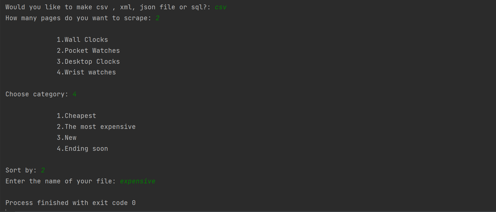
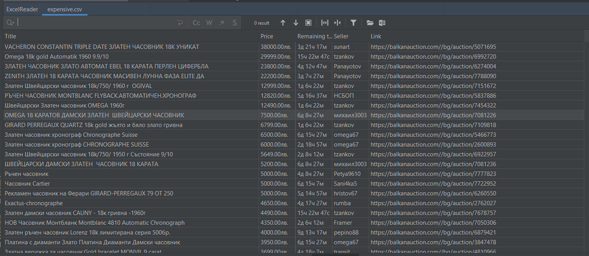

# Webscrapper of auction.bg
University project.Python script that is webscrapping the website auction.bg and collecting data in different formats such as csv,json or directly loading the data into a database. 

Input the text or the numbers : 

Example of webscrapped data: 

